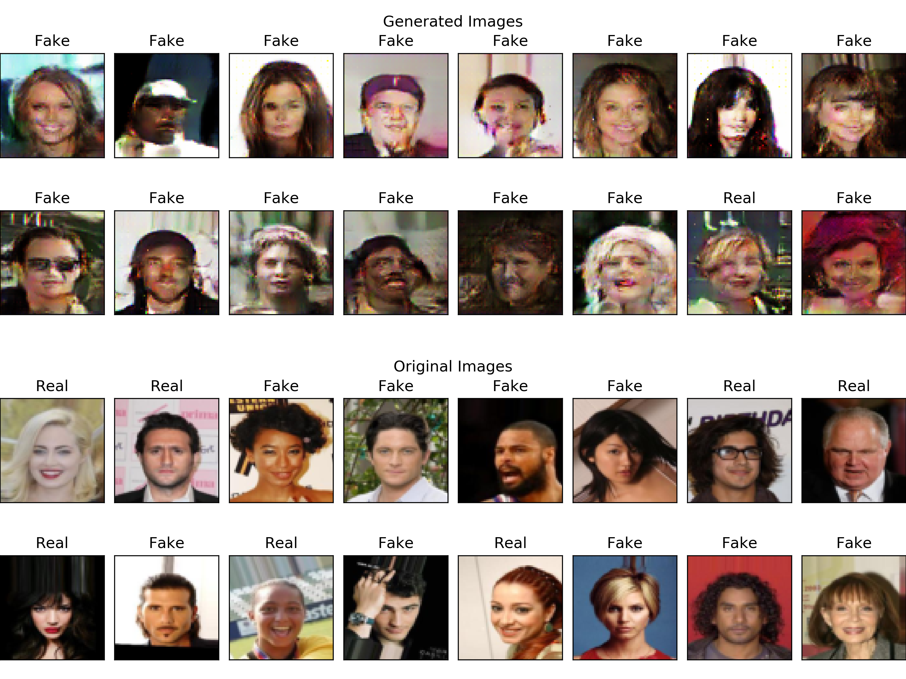
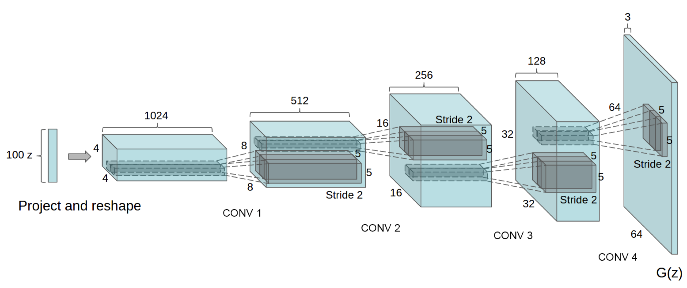

DCGAN for CelebA in PyTorch
===========================

This repository contains an example implementation of a DCGAN
architecture written in PyTroch.

For the demonstration, I've used
[CelebA dataset](http://mmlab.ie.cuhk.edu.hk/projects/CelebA.html).

## How to run it?

Training and visualization should work without any modifications
and default arguments will reproduce my results. Hyperparameters
were taken from the papers but can be tuned by passing arguments
to below scripts.

**Download dataset:**

1. Use [this Google Drive](https://drive.google.com/open?id=0B7EVK8r0v71pZjFTYXZWM3FlRnM)
   to download images (URL points to original dataset shared
   by its authors).

2. Put it into `dataset` directory and unpack.

3. Wrap unpacked directory (`img_align_celeba`) into another one
   named `celeba`. This is a requirement set by PyTorch's
   implementation of ImageFolder.

**Instruction:**

```bash
$ virtualenv -p python3.7 venv
$ . venv/bin/activate
(venv) $ pip install -r requirements.txt
(venv) $ python train.py
(venv) $ python visualize.py --checkpoint={YOUR_CHECKPOINT}
```

**Help:**

```bash
(venv) $ python train.py -h
(venv) $ python visualize.py -h
```

## Training

It takes about 50 epochs to train DCGAN that fools discriminator on
~90% of fake images. Feel free to run it for longer time! A single epoch
takes about ~8:45 minutes on the GTX 1060 6GB.

## Results

**Visualization of example images**



**Visualization of latent space**

Example 1 | Example 2 | Example 3 | Example 4
:---:|:---:|:---:|:---:
 |  |  | 


## DCGAN Architecture



## Resources

* [[arXiv](https://arxiv.org/abs/1406.2661)] _Ian J. Goodfellow,
  Jean Pouget-Abadie, Mehdi Mirza, Bing Xu, David Warde-Farley,
  Sherjil Ozair, Aaron Courville, Yoshua Bengio_
  **"Generative Adversarial Networks"**

* [[arXiv](https://arxiv.org/abs/1511.06434)] _Alec Radford, Luke Metz,
  Soumith Chintala_ **"Unsupervised Representation Learning with Deep
  Convolutional Generative Adversarial Networks"**
